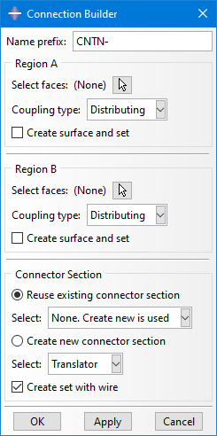

# Abaqus Plugin: Connection Builder
Plugin for Abaqus/CAE to quickly create a Coupling+Connector+Coupling construct

 
More details:

This Plug-In is intended to reduce the time needed to build connection that consist of the combination of Coupling+Connector+Coupling. This is quite common for virtual bolt and pins, but can be used for anything of that kind.

The user selects the two faces regions (can be one or multiple faces) and the Plug-In does the rest. It will calculate the geometric center of both regions, place the reference points there, create the two couplings (Distributed or Kinematic) and the connector. The connector orientation is automatically aligned between the two reference points. An existing connector section can be used or a new one is created automatically. Properly named surfaces and sets can also be created for the face regions and the reference points.

Doing all that manually would take a lot of clicking and time.

Be aware that the Plug-In is only for creating the features. Afterwards you have to use the created individual features if you want to edit or delete them.

See also demo video in media folder.

 

Usage at your own risk.